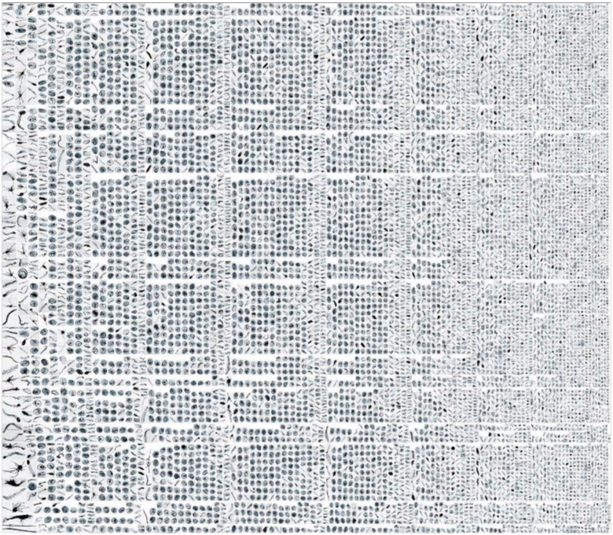

Personal fork as installation instructions were not working for me. Trying to find out why not.
I am running like:
python main.py --source_dir C:\Users\JR13\Downloads\scallopsurvey\2025-05-07 --model_name OSPAR --cruise_name PELTIC --batch_size 300

# Plankton Imager Classifier
[[`paper`](https://google.com)]
[[`dataset`](https://google.com)]

> The Plankton Imager Classifier predicts different plankton and non-plankton classes from data captured by the Plankton Imager ([Pi-10](https://www.planktonanalytics.com/)) sensor. 



## Getting Started
### Data set-up
1. Download model weights from PLACEHOLDER. Two options are available, the `ResNet50-detailed` being more extensive with 49 different possible classifications, and the `OSPAR` model predicting XX classes. Store these into `/models/`
2. Store your raw, unaltered Pi10-data into a preferable location. We recommend storing it in `/data/`, but can be stored in any accessible location using the argument `--source_dir`
3. For map creation, download the "EEA coastline for analysis" from the [European Environment Agency](https://www.eea.europa.eu/en/datahub/datahubitem-view/af40333f-9e94-4926-a4f0-0a787f1d2b8f). Store into `/data/`
4. For map creation, download the "Marine and land zones: the union of world country boundaries and EEZ's (version 4)" from [Marineregions.org](https://www.marineregions.org/downloads.php#unioneezcountry). Store into `/data/`


### Anaconda set-up
```
In miniforge prompt on WINDOWS, specify python version that is compatible with fastai (python 3.12.11 was not):
conda create --name plankton_imager python=3.11
conda activate plankton_imager

# Could not install plankton_imager_classifier, needed to clone it:
cd C:\Users\JR13\Documents\LOCAL_NOT_ONEDRIVE
git clone https://github.com/geoJoost/plankton_imager_classifier.git
cd plankton_imager_classifier

conda install pip

pip install fastai

# Here I use pip rather than the pip3 command because windows
# IMPORTANT: Modify this installation link to the correct CUDA/CPU version
# Check the CUDA version using `nvidia-smi` in the command-line
# If no CUDA is available, use the CPU installation; Be aware that this is significantly slower and discouraged for larger datasets
# See: https://pytorch.org/get-started/locally/
pip install torch torchvision torchaudio --index-url https://download.pytorch.org/whl/cu118

conda install -c conda-forge pandas numpy polars seaborn xlsxwriter chardet geopandas python-docx memory_profiler pyarrow fiona pyproj
```

### Usage
```
# To start the entire pipeline, navigate to your working directory
cd C:\Users\JR13\Documents\LOCAL_NOT_ONEDRIVE\plankton_imager_classifier

# Run the classifier
# See options below
# Not implemented yet
python main.py --source_dir C:\Users\JR13\Downloads\1300 --model_name OSPAR --cruise_name PELTIC --batch_size 300

# For more detailed options, see `main.py`
```

Options available in `main.py`:
* `source_dir`: This should be the path to your data folder directly from the Pi-10. It is recommended to store this within the repository in `/data/`.
* `model_name`: This corresponds to the model to use for inference. Options available are: `ospar` to use the OSPAR classifier (12 classes), or `ResNet50-detailed` to use the ResNet50 model which predicts 49 different plankton and non-plankton classes.
* `cruise_name`: This is used for intermediate outputs and for generating the final report. Any string is accepted without any spaces in the name, use '-' or '_' instead.
* `batch_size`: Number of samples to use within `inference.py`. This is highly dependent on the available memory within your PC/HPC. Default value of 32 is recommended for local machines. 

## Dataset Requirements
Use the original dataset structure as provided by the Pi-10 imager without modifications.

### Raw
```
CRUISE_NAME
├── 2024-06-24
│   ├── 1454.tar
│   ├── 1458.tar
│   ├── 1459.tar
│   ├── 1500.tar
│   ├── 1510.tar
│   ├── 1520.tar
│   ├── 1530.tar
│   ├── 1540.tar
│   ├── 1550.tar
│   ├── 1600.tar
│   ├── 1610.tar
│   ├── 1620.tar
│   ├── 1630.tar
│   └── 1640.tar
├── 2024-06-25
│   ├── 0000.tar
│   ├── 0010.tar
│   ├── 0020.tar
│   ├── 0030.tar
│   ├── 0040.tar
│   ├── 0050.tar
│   ├── 0100.tar
│   ├── 0110.tar
```
### Untarred
```
CRUISE_NAME_UNTARRED
├── 2024-06-24
│   ├── untarred_1454
│   │   ├── Background.tif
│   │   ├── Bubbles.txt
│   │   ├── Cameralog.txt
│   │   ├── HitsMisses.txt
│   │   ├── RawImages\pia7.2024-06-24.1454+N00000000.tif
│   │   ├── RawImages\pia7.2024-06-24.1454+N00000001.tif
│   │   ├── RawImages\pia7.2024-06-24.1454+N00000002.tif
│   │   ├── RawImages\pia7.2024-06-24.1454+N00000003.tif
│   │   ├── RawImages\pia7.2024-06-24.1454+N00000004.tif
```

## Future implementations
1. Refactor `remove_corrupted_files.py` to increase processing speed
2. Implement try-except statement within `inference.py`, with the except using `remove_corrupted_files.py`
3. Implement OSPAR models
4. Remove FastAI implementation


## Known errors
1. Error in `learn.load(MODEL_FILENAME, weights_only=False)` can be caused in older PyTorch versions. In this case, simply remove the `weights_only` argument.
