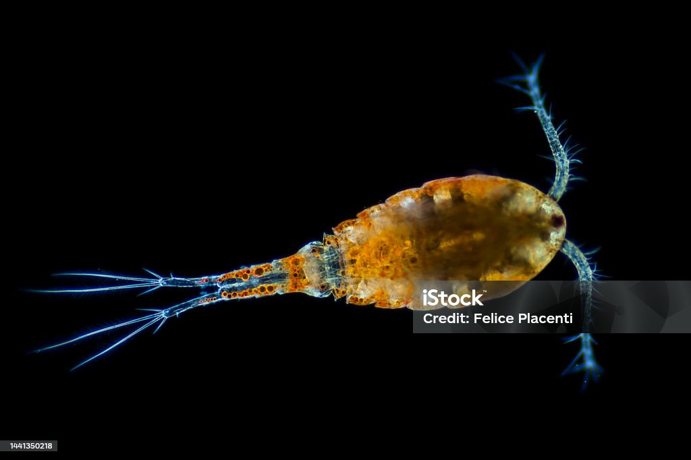

# Plankton Imager Classifier
[[`paper`](https://google.com)]
[[`dataset`](https://google.com)]

> The Plankton Imager Classifier predicts different plankton and non-plankton classes from data captured by the Plankton Imager ([Pi-10](https://www.planktonanalytics.com/)) sensor. 

#

## Getting Started
### Downloads
Download both files and store in /data/
* Model weights from [[`link`]](https://google.com)
* Download the OSPAR data from [[`their website`]](https://odims.ospar.org/en/submissions/ospar_comp_au_2023_01/)

### Anaconda set-up

```
# install the classifier and its dependencies
pip install git@github.com:geoJoost/plankton_imager_classifier.git

# Setup the environment
conda create --name mons

conda activate mons

conda install pip

pip install fastai

# IMPORTANT: Modify this installation link to the correct CUDA/CPU version
# Check the CUDA version using `nvidia-smi` in the command-line
# If no CUDA is available, use the CPU installation; Be aware that this is significantly slower and discouraged for larger datasets
# See: https://pytorch.org/get-started/locally/
pip3 install torch torchvision torchaudio --index-url https://download.pytorch.org/whl/cu118

conda install -c conda-forge pandas numpy polars seaborn xlsxwriter chardet geopandas python-docx memory_profiler
```

### Usage
```
# To start the entire pipeline, navigate to your working directory
cd PATH/TO/WORKING_DIRECTORY

# Run the classifier
# See options below
# Not implemented yet
python main.py --source_dir data/YOUR_DATA_PATH --model_name ResNet50-detailed --cruise_name SURVEY_NAME --batch_size 300

# For more detailed options, see `main.py`
```

Options available in `main.py`:
* `source_dir`: This should be the path to your data folder directly from the Pi-10. It is recommended to store this within the repository in /data/
* `model_name`: This corresponds to the model to use for inference. Options available are: `ospar` to use the OSPAR classifier (XX classes), or `ResNet50-detailed` to use the ResNet50 model which predicts 49 different plankton and non-plankton clases
* `cruise_name`: This is used for intermediate outputs and for generating the final report. Any string is accepted without any spaces in the name, use '-' or '_' instead.
* `batch_size`: Number of samples to use within `inference.py`. This is highly dependent on the available memory within your PC/HPC. Default value of 300 is used for 32GB of RAM.  

## Dataset Requirements
Use the original dataset structure as provided by the Pi-10 imager without modifications.

## Time estimations
To give a rough estimate on the total processing time required, below we share results on an experimental trial. A dataset of ~54GB was used on a local machine with 32GB of RAM and a NVIDIA RTX A5500. Time estimates are as follows:
1. **Untarring**: 38 minutes
2. **Corruption check**:
3. **Inference**:
4. **Random sampling**:
5. **Generating report**: 

## Future implementations
1. Refactor `remove_corrupted_files.py` to increase processing speed
